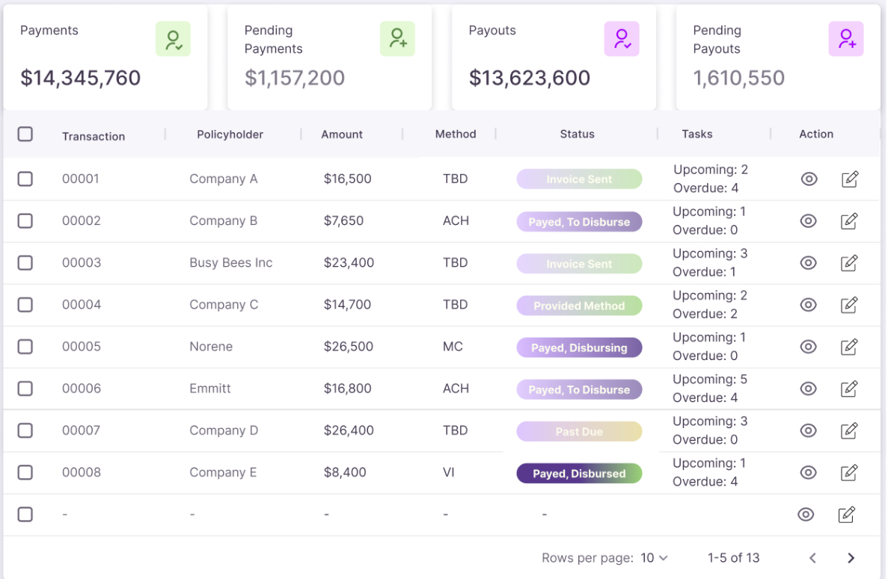

This is a [Next.js](https://nextjs.org/) project bootstrapped with [`create-next-app`](https://github.com/vercel/next.js/tree/canary/packages/create-next-app).

## Getting Started

First, run the development server:

```bash
npm run dev
# or
yarn dev
# or
pnpm dev
```

Open [http://localhost:3000](http://localhost:3000) with your browser to see the result.

You can start editing the page by modifying `app/page.tsx`. The page auto-updates as you edit the file.

## Completing Flexx-Table: Client-Side Data Loading

To complete the Flexx-Table implementation, we need to add client-side data loading using the Next.js API endpoint. This task involves the following steps:

1. Create a new API route for the Flexx-Table data if it doesn't already exist.
2. Implement a fetch function in the client-side component to call the API endpoint.
3. Use React hooks (useState and useEffect) to manage the data state and trigger the API call.
4. Update the table component to use the fetched data instead of static data.
5. Handle loading states and potential errors during the data fetching process.
6. Ensure the table updates reactively when the data is loaded.

To create the aggregated data, we need to create a new API route for the Flexx-Table data:

7. Create a new API route for the top cards (that will forward fake-data).
8. Propagate the data to the client-side component via the API call.
9. Present the data in the top cards.

- Note: Action icons just need to be placeholders.

By completing these steps, we'll have a fully functional Flexx-Table that loads data dynamically from the server, providing a more realistic and scalable solution for data presentation.

## Target Page Design

The Flexx-Table implementation should resemble the following design:



This image showcases the intended layout and functionality of the Flexx-Table, including:

- Sortable columns
- Pagination controls
- Responsive design for various screen sizes

Refer to this image when implementing the Flexx-Table to ensure the final result matches the desired appearance and functionality.
